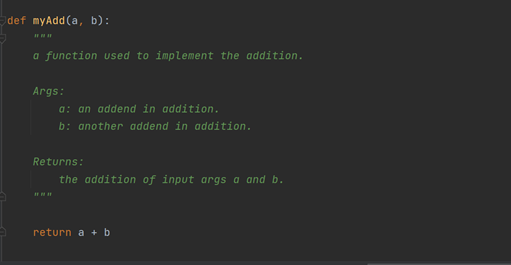
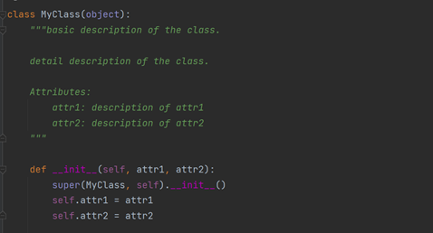
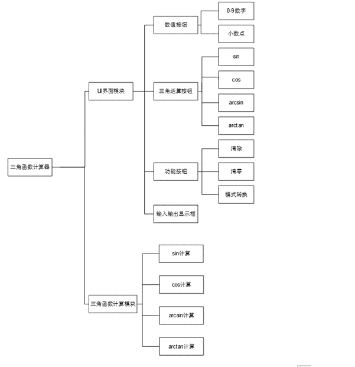

**三角函数计算器总体设计文档**

**1 引言**

**1.1 文档说明**

本文档是三角函数计算器软件总体设计文档，用于对三角函数计算器软件设计开发行为进行规范与引导，以便项目开发人员对本软件的设计与实现有一个较为全面的理解。文档内容包括目标软件功能需求概述、软件结构设计、软件接口设计以及软件开发规范说明等。

**1.2 目标软件概述**

目标软件为一款可以接收不同类型输入（角度与弧度）的三角函数计算器。软件主要包括用户操作界面实现与三角函数计算实现两个模块。操作界面应包含基本的数据输入、数据类型切换、三角函数选择、归零、删除等按钮，并实现输入数据与输出数据的显示。计算器应实现的三角函数包括sin，cos，arcsin，arctan四类。

**1.3 开发规范**

函数注释紧跟函数定义，应包含基本功能描述、参数说明、返回值说明。示例如下：

类注释紧跟类定义，应包含类的基本描述、详细描述以及属性说明，示例如下：

**2 功能需求**

**2.1 计算模块功能需求**

1）正弦函数计算（sin）

输入角度数据/弧度数据，实现正弦函数计算并返回计算结果。

2）余弦函数计算（cos）

输入角度数据/弧度数据，实现余弦函数计算并返回计算结果。

3）反正弦函数计算（arcsin）

输入角度数据，实现正切函数计算并返回计算结果（角度值）。

4）反正切函数计算（arctan）

输入角度数据，实现反正切函数计算并返回计算结果（角度值）。

**2.2 操作界面功能需求**

1）归零按钮（c）

操作界面包含归零按钮实现归零功能。

2）删除按钮（del）

操作界面包含删除按钮实现删除功能。

3）数字按钮（0\~9）

操作界面包含0\~9数字按钮实现数据输入功能。

4）小数点按钮（.）

操作界面包含小数点按钮实现小数数据输入功能。

5）函数按钮（sin/cos/arcsin/arctan）

操作界面包含正弦、余弦、正切、反正切四个函数按钮实现函数选择功能。

6）符号按钮（+/-）

操作界面应包含符号按钮实现正负数输入功能，当前函数

7）模式切换按钮（mode）

操作界面包含模式切换按钮实现输入类型切换（degree/radian）。

8）数据显示功能

操作界面包含数据显示区域，显示内容包括所选函数、输入数据、数据类型、计算结果以及归零显示。

**3 结构设计**

**4 接口设计**

**4.1 用户接口**

图形化用户操作界面，此界面清晰的展示软件所具有的各项功能。此界面包含数字按钮、函数按钮、归零按钮、删除按钮、小数点按钮、模式切换按钮以及数据显示区域。

**4.2 内部接口**

1.  正弦函数：sin(input: float, radian_mode: str =‘False’)

    输入参数：input: 输入数据

    radian_mode: 弧度模式，默认为“False”

    返回值：计算结果（float）

    描述：sin函数对输入数据（角度或弧度）进行正弦计算，返回计算结果；

2.  余弦函数：cos(input: float, radian_mode: str =‘False’)

    输入参数：input: 输入数据

    radian_mode: 弧度模式，默认为“False”

    返回值：计算结果（float）

    描述：cos函数对输入数据（角度或弧度）进行余弦计算，返回计算结果；

3.  反正弦函数：arcsin(input: float)

    输入参数：input: 输入数据

    返回值：计算结果（float）

    描述：arcsin函数对输入数据进行反正弦计算，返回计算结果（角度值）；

4.  反正切函数：arctan(input: float)

    输入参数：input: 输入数据

    返回值：计算结果（float）

    描述：arctan函数对输入数据进行反正切计算，返回计算结果（角度值）；

5.  函数选择：compute(compute_type: int)

    输入参数：compute_type: int值，计算类型标识

    返回值：None

    描述：compute函数在用户点击四个三角函数按钮时被调用，函数获取三角函数类型标识作为输入参数，调用相应角函数对数据进行计算，并调用显示函数将计算结果显示到显示区域；

6.  文本转换函数：str_to_number()

    输入参数：无

    返回值：字符串对应的值

    描述：str_to_number函数将显示框文本转换为对应的数值；

7.  显示：display_to_box(content: str)

    输入参数：content 需要显示的内容

    返回值：None

    描述：将输入的文本内容显示到显示区域；

8.  显示数字：display_number(input: float/int)

    输入参数：input 要显示的数字值

    返回值：None

    描述：display_umber函数在用户点击数值按钮被调用，将数值显示到显示区域；

9.  显示小数点：display_dot()

    输入参数：无

    返回值：None

    描述：display_dot函数在用户点击小数点按钮时被调用，在显示区域显示小数点。若当前数值已存在小数点则不再增加显示小数点；

10. 符号转换函数：change_sign()

    输入参数：无

    返回值：None

    描述：change_sign函数在用户点击“+/-”按钮时被调用，改变显示框上文本的正负号；

11. 归零：display_reset()

    输入参数：无

    返回值：None

    描述：display_reset函数在用户点击归零按钮时被调用，重置显示区域内容为0；

12. 删除：display_del_one_number()

    输入参数：无

    返回值：None

    描述：displayDel函数在用户点击删除按钮时被调用，删除当前显示区域的最右侧一位数字或小数点。若被调用时显示区域仅有一位显示，调用后显示区域显示0；若当前显示区域显示计算输出，则点击删除按钮不调用该函数；

13. 模式切换：change_mode()

    输入参数：无

    返回值：None

    描述：change_mode函数在用户点击模式切换按钮时被调用，将计算器模式转换为另一模式；
